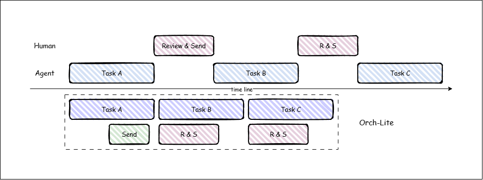

# Orch-lite

[English](#english) · [中文](#中文)

<a id="english"></a>

## English

**Let agents work. Keep the human workflow moving.**

Orch-lite is a lightweight background-execution skill for Coding Agents.

Its core is a single idea: **decouple agent execution from human conversation and decision-making.**

When an agent takes on time-consuming work — modifying code, running tests, debugging, generating documentation — the work no longer occupies the current session while it runs. It is dispatched to a background agent instead. Meanwhile, the human can keep thinking, asking questions, adding requirements, adjusting direction, or starting the next task.

The agent keeps working, and the human workflow is never interrupted.

---

## Installation

### ZCode

Open **Settings → Plugins → Personal**, click **Create → Add marketplace**, enter `LYJ132/orch-lite` as the GitHub repo source, and click **Create**. Refresh the marketplace, then click **Install** on the Orch-lite plugin card.

### Codex

Add the marketplace and install from CLI:

```bash
codex plugin marketplace add LYJ132/orch-lite
codex plugin add orch-lite
```

Or open Codex and run `/plugins` to browse and install. After installation, run `/hooks` to review and trust the bundled hooks.

### Claude Code

Claude Code adapter lives on the `feature/claude-code` branch. **Not yet verified.**

---

## Decoupling: Two Independent Timelines

A traditional Coding Agent interaction is a serial chain of alternating waits: the human makes a request, the agent executes, the human waits; the agent needs direction, the human decides — and so on. Human decisions and agent execution are bound to one timeline, with waiting baked into the interaction model rather than required by the work itself. Meanwhile, as sessions grow, execution content — code diffs, logs, test output, debugging traces — piles up and gradually turns a conversation meant for requirements and decisions into an execution log.

Orch-lite's response is not more agents, but **giving the human workflow and agent execution two independent timelines.**



The diagram compares the two interactions:

- **Top (traditional):** the agent's Task A/B/C and the human's Read & Send blocks are serially staggered — the human waits while a task runs, and the agent starts the next task only after the human sends a message. Both sides wait on each other.
- **Bottom (Orch-lite):** Task A/B/C form a continuous pipeline, with the human's Send and Read & Send blocks interleaved with task execution. The agent keeps advancing, and the human keeps working.

The two timelines are no longer synchronized: the human's decision flow stays continuous while agent execution proceeds in parallel in the background.

This separation brings two concrete forms of decoupling. **Context decoupling** keeps the main session clean: requirements, ideas, direction, questions, decisions, and review results stay in the conversation, while file edits, tool calls, tests, logs, debugging, and execution detail live with the background agent. Execution detail still exists and is tracked by the task system, but it no longer occupies the center of the conversation — yielding a cleaner main-session context, less redundant execution content, longer-lived sessions, and in suitable cases lower token consumption. Token savings are a consequence, not the goal.

**Attention and cognitive decoupling** goes further. The main session becomes a space for thinking about goals, trade-offs, and next steps, rather than a place to stream what the agent just executed, what a command printed, or why a test failed. The latter is essential for execution, but it should not crowd out the conversation. When the main session stays focused on intent and direction, the agent can devote its attention to understanding real intent instead of burning context on execution detail.

---

## Decisions Stay with the Human

Decoupling execution from interaction does not mean removing the human from the workflow.

Orch-lite's goal is not agents deciding everything on their own, but: **machines work in parallel; key decisions remain with the human.**

```
Agent executes → needs direction → hands back → human decides → agent continues
```

```
Agent A and Agent B executing
   → A completes → human reviews A → human decides continue / revise / integrate
```

The human decision flow is fully preserved. What changes is only this: **the human no longer pauses their own work waiting for an agent to finish.**

What is reduced is waiting, not the human.

---

## Multi-Agent Is a Means, Not the Goal

Background agents, task state, Git, and worktrees exist to serve the goals above. Orch-lite does not attempt to:

- build an agent swarm;
- make large numbers of agents collaborate autonomously;
- build a general-purpose distributed scheduler;
- maximize agent count;
- support agents running unattended for long periods.

The question it answers is: **why must a human stop working while an agent works?**

Multi-agent is an implementation means, not a product goal.

---

## How It Works

### Main session and child agents: roles defined by two skills

Orch-lite does not rely on a platform-provided role system. Responsibilities are split across two skill documents:

| Skill | Audience | Responsibility |
|---|---|---|
| orch-lite | Main session | Understand intent, route every request, dispatch tasks, coordinate state, integrate results; handles conversation and read-only actions directly, dispatches every write |
| orch-lite-executor | Child agent | The dispatched executor's handbook: workspace boundaries, incremental-commit discipline, completion and failure reporting |

A child agent's first action after dispatch is to read the executor handbook — the rules in the dispatch package are only a summary; the handbook is canonical. The main session never executes work itself, and a child agent never spawns further agents.

### Task tracking: index.json

Background tasks do not live inside any session. Their state is recorded in `.orch-lite/index.json` at the project root:

```json
{
  "tasks": {
    "impl-20260911-01": {
      "role": "impl",
      "feature_id": "login-api-fix",
      "status": "assigned",
      "objective": "Fix the 500 error of the login API",
      "acceptance_criteria": ["login API returns 200"],
      "output": null,
      "products": [],
      "agent_id": null,
      "created_at": "2026-09-11T10:00:00+08:00",
      "completed_at": null
    }
  }
}
```

It is a flat structure keyed solely by task_id, recording role, feature, status, objective, acceptance criteria, products, and the agent actually executing the task. The main session is the exclusive writer: creating an entry at dispatch, updating results when a child reports. Sessions may end and agents may change; task state is always on disk — queryable and resumable.

### Isolation and parallelism: feature branches and worktrees

- Each feature maps to one long-lived branch, `feature/<feature_id>`; all of the feature's tasks progress on that line.
- Isolation is lazy: with a single task, the child works directly on the feature branch in the primary working tree, with zero extra overhead; when a task is already running and a new one arrives, the newcomer gets its own git worktree (`.worktrees/<task_id>/`).
- Children never commit to main; main only receives integration merges performed by the main session. A pre-merge conflict check stops and hands the decision to the human when conflicts exist.

```
          Repository
   ┌──────────┼──────────┐
   ↓          ↓          ↓
 Task A     Task B     Task C
 worktree   worktree   worktree
   │          │          │
   ↓          ↓          ↓
 Agent A    Agent B    Agent C
```

### Child-agent reuse

Before dispatching a new task, the main session reads the feature's history in the index and avoids duplicate work through two layers of reuse:

1. **Session reuse (continuation):** if the agent of a completed task covering the same scope is still resumable, the main session prefers sending it a continuation package (new objective + delta context) over creating a fresh agent. A fresh child is created only when a parallel slot is needed or the old context has become a liability.
2. **Conclusion reuse (reuse loop):** when the feature already has tasks in the index, the dispatch package must carry a `reuses` field listing the historical task_ids the main session actually read. The dispatch-validation hook enforces this: omission is denied with a digest of the history, and unknown ids are denied as well. The child builds on prior conclusions instead of re-deriving them.

The dispatch package itself (objective + acceptance criteria) is the complete definition of an agent — there is no registry and no predefined roles; the agent is whatever the task requires. Experiences and contracts that survive across tasks are stored separately in `.orch-lite/memory/shared.json` for the main session and child agents to read and reuse.

---

## Closing

Orch-lite does not try to replace human work with agents. It changes the time structure of how humans and agents work together:

```
Traditional:
Human ──→ Agent
  ↑          │
  └──────────┘
   mutual waiting

Orch-lite:
Human workflow ──────────────────────────→
Agent A   ─────────────→
Agent B        ─────────────→
Agent C             ────────────→
```

The goal is not to remove the human from the workflow, but **to remove unnecessary waiting from the workflow.**

Let agents work. Keep the human workflow moving.

---

<a id="中文"></a>

## 中文

**让 Agent 去工作，让人的工作流继续。**

Orch-lite 是一个面向 Coding Agent 的轻量级后台执行 Skill。

其核心只有一点：**将 Agent 的执行与人的对话和决策解耦。**

当 Agent 承担修改代码、运行测试、调试、生成文档等耗时工作时，不再占住当前会话等待执行结束，而是将具体工作派发给后台 Agent。与此同时，人可以继续思考、提问、补充需求、调整方向，或启动下一个任务。

Agent 持续工作，人的工作流也不中断。

---

## 安装

### ZCode

打开 **设置 → 插件 → 个人**，点击 **Create → Add marketplace**，输入 GitHub 仓库 `LYJ132/orch-lite` 作为来源，点击 **Create**。刷新 marketplace 后，在 Orch-lite 插件卡片上点击 **Install**。

### Codex

从 CLI 添加 marketplace 并安装：

```bash
codex plugin marketplace add LYJ132/orch-lite
codex plugin add orch-lite
```

或打开 Codex 运行 `/plugins` 浏览安装。安装后运行 `/hooks` 审核并信任内置的 hooks。

### Claude Code 适配

Claude Code 适配代码位于本仓库的 `feature/claude-code` 分支。**尚未验证。**

---

## 解耦：两条独立的时间线

传统 Coding Agent 的交互是一条交替等待的链：人提出需求，Agent 执行，人等待；Agent 需要方向，人决定——如此循环。人的决策与 Agent 的执行被绑定在同一条时间线上，多数等待并非工作本身的要求，而是交互方式造成的结果。与此同时，随着会话不断增长，代码 diff、日志、测试输出、调试痕迹等执行内容持续堆积，原本用于承载需求、想法和决策的对话，逐渐退化为 Agent 的执行日志。

Orch-lite 的关键不在于增加 Agent 的数量，而在于**让人的工作流与 Agent 的执行各自拥有独立的时间线。**


图中对比了两种交互：

- **上半部分（传统模式）**：Agent 的 Task A/B/C 与人的 Read & Send（阅读并发送）串行错开——任务执行时人等待，人发出消息后 Agent 才开始下一项工作，双方相互等待。
- **下半部分（Orch-lite）**：Task A/B/C 紧密衔接为连续流水线，人的 Send 与 Read & Send 穿插于任务执行期间。Agent 持续推进，人也持续工作。

两条时间线不再同步：人的决策流程保持连续，Agent 的执行在后台并行推进。

这种分离带来两个具体的解耦层次。**上下文解耦**让主会话保持整洁：用户需求、想法、方向、问题、决策与审核结果留在对话中，文件修改、工具调用、测试、日志、调试与执行细节则由后台 Agent 承载。执行细节依然存在、可被任务系统追踪，却不再占据交流的主要空间——主会话上下文更干净、冗余执行内容更少、长会话更易维持，并在适当场景下降低 Token 消耗。Token 节省是上下文解耦的结果，而非设计目标。

**注意力与认知解耦**更进一步。主会话应是讨论目标、取舍与下一步的空间，而不是实时播报 Agent 刚执行了什么、某条命令输出了什么、某个测试为何失败。后者对执行至关重要，却不应持续占据交流的中心。当主会话聚焦于意图与方向时，Agent 也能将更多注意力用于理解真实意图，而非在执行细节中消耗上下文。

---

## 决策权始终在人手中

执行与交互的解耦，并不意味着将人移出工作流。

Orch-lite 的目标不是让 Agent 自行决定一切，而是：**机器并行工作，关键决策仍由人掌握。**

```
Agent 执行 → 需要方向判断 → 交还给人 → 人做决定 → Agent 继续执行
```

```
Agent A、Agent B 执行中
   → A 完成 → 人审核 A → 人决定继续 / 修改 / 整合
```

人的决策流程完整保留，改变的只是：**人不再为等待 Agent 完成而暂停自己的工作。**

减少的是等待，不是人。

---

## Multi-Agent 是手段，不是目的

后台 Agent、任务状态、Git、worktree 等机制，服务于上述目标而存在。Orch-lite 并不试图：

- 构建 Agent swarm；
- 让大量 Agent 自主协作；
- 建立通用分布式调度系统；
- 追求 Agent 数量；
- 支持 Agent 长时间无人自主运行。

它要回答的问题是：**Agent 工作时，人为什么必须停止工作？**

Multi-Agent 是实现手段，而非产品目标。

---

## 实现机制

### 主会话与子 Agent：两份 Skill 定义的分工

Orch-lite 不依赖平台预置的角色体系，而是通过两份 Skill 文档划分职责：

| Skill | 面向 | 职责 |
|---|---|---|
| orch-lite | 主会话 | 理解意图、对每个请求做路由判断、派发任务、协调状态、整合成果；只直接处理对话与只读操作，一切写操作都派发 |
| orch-lite-executor | 子 Agent | 被派发者的执行手册：工作区边界、增量提交纪律、完成与失败的报告格式 |

子 Agent 收到派发后的第一个动作是读取 executor 手册——派发包中的规则只是摘要，手册才是准绳。主会话不亲自执行，子 Agent 也不再派生新的 Agent。

### 任务追踪：index.json

后台任务不依附于任何会话存在，其状态记录在项目根目录的 `.orch-lite/index.json`：

```json
{
  "tasks": {
    "impl-20260911-01": {
      "role": "impl",
      "feature_id": "login-api-fix",
      "status": "assigned",
      "objective": "Fix the 500 error of the login API",
      "acceptance_criteria": ["login API returns 200"],
      "output": null,
      "products": [],
      "agent_id": null,
      "created_at": "2026-09-11T10:00:00+08:00",
      "completed_at": null
    }
  }
}
```

这是以 task_id 为唯一主键的扁平结构，记录角色、所属特性、状态、目标、验收标准、产物与实际执行该任务的 Agent。主会话独占写入：派发时创建条目，子 Agent 报告后更新结果。会话可以结束、Agent 可以更替，任务状态始终落盘、可查、可恢复。

### 隔离与并行：feature 分支与 worktree

- 每个特性对应一条长生命周期分支 `feature/<feature_id>`，该特性的任务都在这条线上推进；
- 隔离按需启用：只有一个任务时，子 Agent 直接在主工作树的 feature 分支上工作，零额外开销；已有任务在执行、新任务到来时，新任务获得独立的 git worktree（`.worktrees/<task_id>/`）；
- 子 Agent 永不提交到 main，main 只接收主会话执行的整合合并；合并前进行冲突预检，存在冲突时停下，交由人决定。

```
          Repository
   ┌──────────┼──────────┐
   ↓          ↓          ↓
 Task A     Task B     Task C
 worktree   worktree   worktree
   │          │          │
   ↓          ↓          ↓
 Agent A    Agent B    Agent C
```

### 子 Agent 的复用

派发新任务前，主会话先查阅 index 中该特性的历史，通过两层复用避免重复劳动：

1. **会话复用（continuation）**：若已完成的同范围任务对应的 Agent 仍可恢复，优先向其发送续作包（新目标 + 增量上下文），而非新建 Agent；仅在需要并行槽位、或旧上下文已成为负担时才新派。
2. **结论复用（reuse loop）**：该特性在 index 中已有任务时，派发包必须携带 `reuses` 字段，列出主会话实际读过的历史 task_id。派发校验 hook 强制执行该约束：遗漏会被拒绝并返回历史摘要，填写未知 id 同样会被拒绝。子 Agent 据此在前序结论上继续，而非重新推导。

派发包本身（目标 + 验收标准）即 Agent 的全部定义——没有注册表，没有预设角色，任务需要什么，Agent 就是什么。跨任务沉淀下来的经验与契约另存于 `.orch-lite/memory/shared.json`，供主会话与子 Agent 读取复用。

---

## 结语

Orch-lite 不试图让 Agent 取代人的工作，而是改变人与 Agent 共同工作的时间结构：

```
传统模式：
人 ──→ Agent
↑        │
└────────┘
   相互等待

Orch-lite：
人的工作流 ─────────────────────────────→
Agent A   ─────────────→
Agent B        ─────────────→
Agent C             ────────────→
```

目标不是让人退出工作流，而是**让不必要的等待退出工作流。**

让 Agent 去工作，让人的工作流继续。
